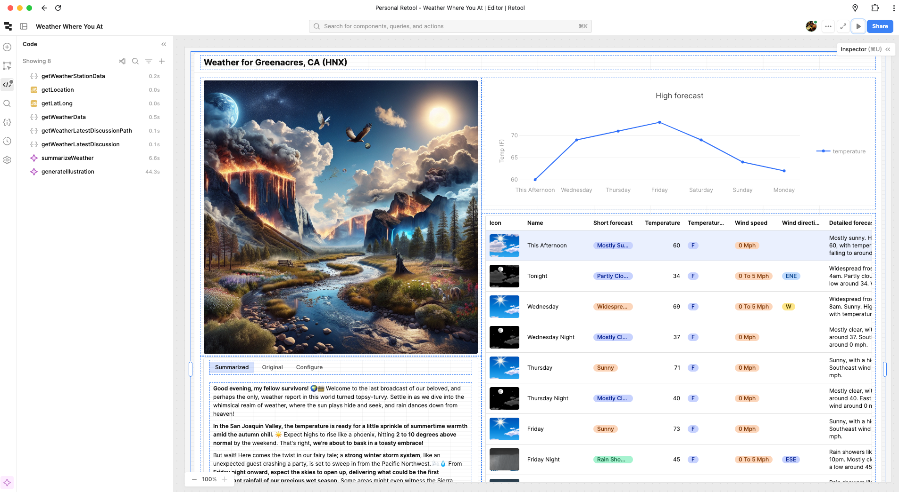

# retool-devrel

This repo is about my (@episod) adventures in leading developer relations at Retool. You can [learn more about what we're doing in Retool DevRel](https://retool.com/blog/retool-developer-relations).

These are public projects related to my work incubating a new team at Retool.

## Weather Dashboard

`weather-dashboard` is a starter Retool project for learning resources, queries, and components. It uses a few different APIs and the query timing doesn't always work out just right. Just the same, you can step-by-step make this work too.

* `weather-dashboard.json` is a [Retool App export](https://docs.retool.com/apps/guides/app-management/import-export) of what's described in the tutorial. It's not very human-readable but the app itself was built by a human.
* [`tutorial.md`](weather-dashboard/tutorial.md) was mostly generated by AI based on the JSON file above. It's meant to _explain_ what is happening in an existing app. The tutorial is written with perspective that a human developer advocate candidate will follow the tutorial and reflect on the experience as part of a job application process. You don't need to finish the tutorial to succeed, just experience the product with its guidance and write some thoughts down.
* [`prompt.md`](weather-dashboard/prompt.md) is additional context provided to the AI writing the tutorial, tying in the story about a developer advocacy role the reader is interviewing for at Retool.
* [`exercise.md`](weather-dashboard/exercise.md) describes the hiring exercise in more detail!
 
I hope your weather report inspires you to build more with Retool.

