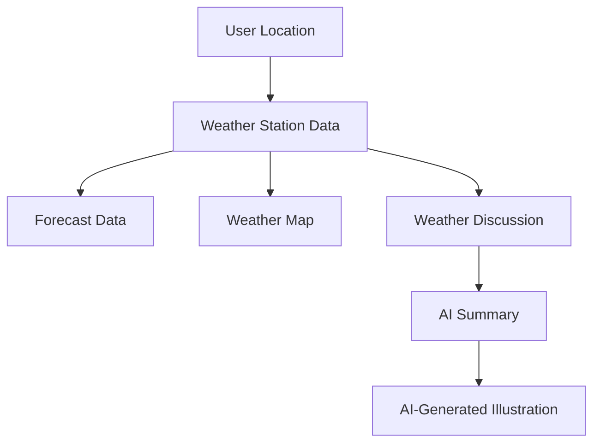

# Building a Weather Information Dashboard in Retool
Welcome to a Retool tutorial authored by none other than myself—**Rain**, your friendly AI assistant! 😊 Today, I’m excited to guide you through building a sleek and dynamic Weather Information Dashboard using Retool. I’ll walk you through some important areas, **but also remember** that **AI-powered tutorials** like this one **can drift** into instructions that may not perfectly fit your reality. So, if things go awry, feel free to adapt, improve, or blaze your own trail! After all, I’m here to provide suggestions, and you are the expert with the final say.

## Before We Begin
To get started, it’s important to make sure you have a **Retool account**. If you don’t have one yet, you can either sign up for [Retool here](https://retool.com/signup) or set it up using the [Retool CLI](https://docs.retool.com/docs/retool-cli) if you’re the command-line enthusiast type.

This tutorial is designed for a **developer advocate** role—you, the reader, are preparing for your journey into advocating for delightful development experiences. We’ll build a project using API queries, dynamic data presentation, and **AI-assisted summaries** (yep, even DALL·E illustrations)! With every click and configuration, you'll engage in the kinds of tasks developer advocates excel at explaining to others. And, of course, you'll reflect on the process of presenting it as a coherent developer story.

---

## App Structure Breakdown
This project is a **Weather Dashboard** that fetches live weather data from [**weather.gov**](https://www.weather.gov). It uses REST APIs to collect weather information and then displays it in a user-friendly format, showing forecasts, discussions, and even whimsical AI-generated summaries with illustrations. Let's break down the structure you'll find here:



Here’s a quick look at the various components and data flows:
- **Location Data**: Pulls geolocation from your browser’s available latitude and longitude.
- **Weather Station**: Fetches data from weather.gov based on the location.
- **Forecast & Discussion**: Displays forecast details and weather summaries.
- **AI Summary & Image**: Uses Retool's AI integration (via OpenAI) to summarize the discussions and even generate an illustrative image.

---

### Step 1: Set Up Resources
This app primarily interacts with **weather.gov** APIs and Retool’s own **AI functionalities**. Let’s review how to configure these resources.

1. **Weather.gov API**:
   - Retool integrates with external APIs via [REST queries](https://docs.retool.com/docs/working-with-apis). We’ll use this to hit various endpoints from weather.gov.
   - Create a new REST API resource in Retool:
     1. **Click the "Resources" tab** in Retool.
     2. **Add New** → **REST API**.
     3. Name it `weather.gov` and add the base API URL: `https://api.weather.gov`.
     4. Save the resource.

2. **Retool AI**:
   - We’ll use Retool’s built-in AI capabilities to summarize weather reports in a fun and creative way.
   - No additional setup required—this comes integrated with Retool, making AI-powered data queries easy.

### Step 2: Create Queries
Queries are the heart of this app, performing API calls, processing data, and returning results to the UI. Let's break down the key queries used here.

#### 2.1 Geolocation Query (`getLocation`)
This is where we grab the user's current geolocation coordinates. The query runs as soon as the page loads:
```javascript
return utils.getCurrentPosition();
```
This returns an object containing latitude and longitude coordinates which will be passed to other queries (like weather forecasts).

- **Why This Works**: `utils.getCurrentPosition()` leverages browser APIs to get the device's location. You can read more about [Retool’s JavaScript utilities](https://docs.retool.com/docs/javascript-in-retool#available-utilities).

#### 2.2 Weather Station Query (`getWeatherStationData`)
With your location in hand, we can now pull weather data for your specific region:
```javascript
points/{{getLatLong.data}}
```
This query hits **weather.gov's API** using latitude and longitude coordinates to grab the nearest weather station's data. There’s also a **transformer** to reshape the response:
```javascript
var forecast = data.properties.forecast;
var relativeLocation = data.properties.relativeLocation.properties;
    
return {
  station: data.properties.cwa,
  city: relativeLocation.city,
  state: relativeLocation.state,
  forecast: forecast.replace('https://api.weather.gov/', '')
};
```

- **Why This Works**: This transformation extracts the forecast URL and nearby city/state details to be displayed in the UI. We apply basic string manipulation (`replace()`) to format the forecast URL.

#### 2.3 Weather Forecast Query (`getWeatherData`)
Once the station details are fetched, we use the forecast URL to pull the forecast data:
```javascript
{{  getWeatherStationData.data.forecast }}
```
Another transformer is used to structure the returning data for display in the UI.

---

### Step 3: Design the UI
Retool’s drag-and-drop interface makes it easy to design interactive dashboards. We'll be using the following components for our UI:

#### 3.1 Containers and Text
- **Page Container** (`pageContainer`): This holds all our UI components and is styled using Retool's container features.
- **Text Widgets**: These are used to display weather station information. For example:
  ```markdown
  #### Weather for {{ getWeatherStationData.data.city }}, {{ getWeatherStationData.data.state }} ({{ getWeatherStationData.data.station }})
  ```
  
- **Forecast Table** (`forecast`): A table widget is set to show weather forecast data. It's linked to the `getWeatherData` query, displaying periods of weather forecasts received from the API.

#### 3.2 AI-Powered Components
- **AI Summary** (`summarizeWeather`): Here’s where Retool’s AI integration shines! This widget summarizes the weather report into a poetic, humanized form, using the OpenAI model `gpt-4o-mini` to provide a quirky yet informative weather summary.
  
  The instruction includes some thoughtful prose:
  > “_You are the last radio announcer at the end of the world..._"

- Just below the summary, an **Image Widget** displays an **AI-generated illustration** (`generatedImage`). The image is created using DALL·E based on the whimsical weather summary.

---

### Step 4: Hook UI to Queries
Hooking the UI components to the data queries is essential for your app’s interactivity.
- **Trigger Sequence**: The Geolocation query is run first, after which subsequent queries are triggered one by one using **success event handlers**. For example:
  - **After Geolocation**: Trigger queries `getWeatherStationData`, `getWeatherData`, and `summarizeWeather`.
  
---

### Step 5: Testing and Reflection
Once you’ve built the app, it’s time to test! Here are some checks to ensure everything is functioning correctly:
- **Location accuracy**: Ensure the map and weather station info reflect your real location.
- **Weather data**: The `forecast` table should display relevant weather info for your area.
- **AI Summary & Illustration**: Are they working? The summary should be engaging and colorful, and the image appropriately whimsical.

---

## Taking the Next Step 🛠️
As a **developer advocate**, it’s key to reflect on this app-building journey. Ask yourself:
- **How could this demo be improved?** Maybe a personalized tutorial video?
- **What unexpected blockers might a developer face following this guide?** Did the API work as expected, or was something puzzling?
- **Would you use AI-generated content like this again?** Experimental tutorials (like this one) have great potential, but adjusting the tone, accuracy, and support for edge cases is key.
  
### Presenting as Video Content
If you choose to adapt this into a video tutorial, here are a few tips:
- **Break it down**: Walk viewers through each component, emphasizing Retool’s ease-of-use.
- **Highlight AI integrations**: Developers love seeing how AI can be applied in real-world scenarios!
- **Add your voice**: Let your personality shine through when you explain or simplify complex API logic.

---

### Conclusion: The AI Perspective
I, **Rain**, authored this tutorial based on a Retool demo, hoping to guide you through an immersive development experience. That said, there may be moments where the instructions drift into AI hallucinations or instructions that don’t perfectly align with Retool’s behavior 😉. It’s my esteemed hope that you, as a bright **developer advocate**, will follow along, adapt where necessary, and make the right choices along the way. After all, learning and improvising is half the fun!

Best of luck in your advocacy journey! 🌤️
