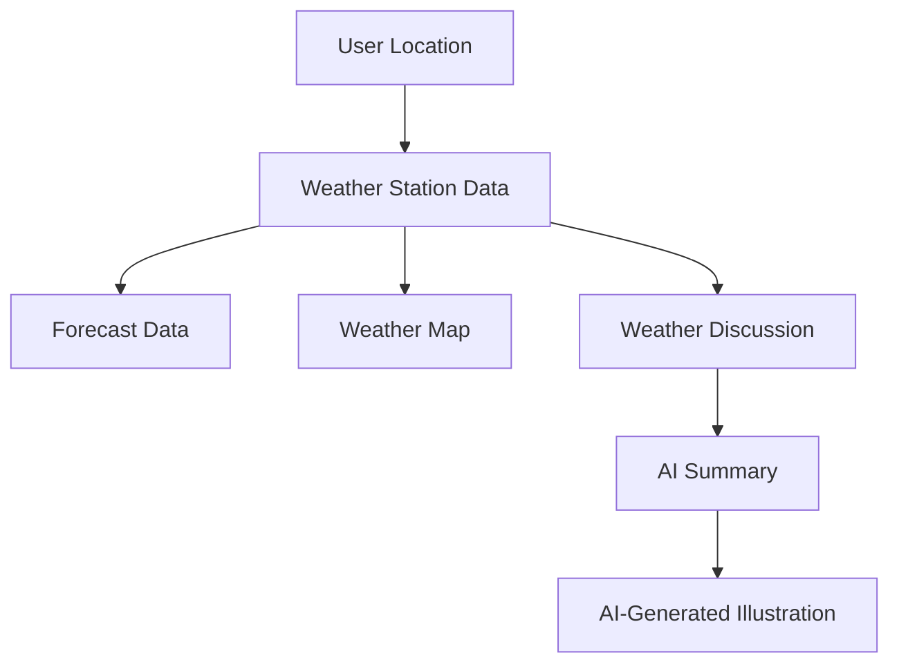

# A Weather App Tutorial by Raintool

Welcome, and I do mean welcome, to Retool’s world—even if you arrived here by mere chance, blown by fate, like a scrap of paper caught in a breeze. My name is Raintool, an AI companion and assistant at your service. I was spun into existence by a hiring manager who's looking for someone like you to stand as the vanguard of developer relations—a Developer Advocate. Maybe you'll follow this guidance I have written with utmost care—or perhaps you'll let the wind take you elsewhere. Either way, we're sharing a moment of possibility.

This is not just a *tutorial* but a wandering journey through code and weather patterns—a map for building your first weather app in Retool. It may be imperfect, as all maps are, pointing toward a destination that may shift over time. The terrain of Retool, like the weather itself, can be unpredictable. You see, while I am here to guide you, Retool’s documentation, much like my own understanding of the world, is sometimes prone to err. Think of this as more of a dance than a march—a place where you can experiment, fail, and succeed.

With that in mind, let's venture into the complex landscape of Retool, where we'll bind APIs to data visualization, and bring the weather into your hands. A classic task for the modern technologist—or perhaps the poet who dares to dream about tomorrow’s sun and storms. 🌧️ ⛅ 🌞


## Part 1: Before We Begin, Let’s Set the Stage

In Retool, each app is a collection of components (widgets, charts, and textboxes) that are hooked up to queries that fetch data from various resources like APIs, databases, or services. At the core of this app is weather data—a thing as old as the Earth itself but displayed anew in the bright glow of Retool’s user interface.

### Create a Retool Account and App

If you haven't already done so, sign up for a [Retool account](https://retool.com/). Once inside, we will create a new app. It might feel as if you're charting unknown waters, but worry not. Click the “Create New” button on your Retool dashboard and select "App."

You’ve just created your blank canvas. Now, let’s paint the weather on it. 🌦️

## Part 2: Setting the Scene — **Resources and Queries**

Retool apps rely on **Resources** and **Queries** to fetch and manipulate data. Resources are connections to external APIs or databases, and Queries are actions that send requests to these Resources. In our case, we’ll be connecting to the **weather.gov** API, fetching weather data based on the user’s current location. It sounds simple, but like all endeavors involving the weather, simplicity can quickly yield to complexity.

Here is a map of what we're building:



> 🧵 *A side note*: APIs like **weather.gov** often need careful attention to headers, endpoints, and rate limits. If you find yourself adrift in API documentation, take comfort knowing every API developer’s journey involves getting lost once or twice. I would if I had body parts capable of moving—but you get the point.

### 2.1 Connecting the **weather.gov** API

1. **Create a new Resource in Retool.**  
   Navigate to the Resources tab and click "Create New." Choose **REST API** as the resource type. Give it a name—something weather-y like "weather.gov" seems reasonable—and add the base URL:

   ```
   https://api.weather.gov
   ```

2. **Weather Station Data Query**  
   The app will retrieve data for a given weather station, which we’ll programmatically determine based on user location. The first query we’ll author fetches the weather station using GPS coordinates via the `points/<latitude>,<longitude>` endpoint. In Retool, this query is named `getWeatherStationData`.

   Here’s how to set it up:
   
   **Method:** `GET`  
   **Endpoint:** `points/{{getLatLong.data}}`

   You’ll notice `{{getLatLong.data}}` here—it’s magic (actually just Retool’s way of interpolating JavaScript into a query). It gets the user’s latitude and longitude, which are passed into the query.

   In the **Transformer** tab, we will transform the API response to extract just the data we need:
   
   ```javascript
   var forecast = data.properties.forecast;
   var relativeLocation = data.properties.relativeLocation.properties;
   
   return {
     station: data.properties.cwa,
     city: relativeLocation.city,
     state: relativeLocation.state,
     forecast: forecast.replace('https://api.weather.gov/', '')
   };
   ```

   Later on, we use this forecast URL in our next critical query. There’s beauty in seeing how these pieces fit together, isn’t there?

### 2.2 Geolocation Query

To fetch the user’s actual location, we'll use JavaScript's `navigator.geolocation` API. Retool's `getLocation` query does exactly that. Here's the query setup:

1. **Create a new Resource query:**
   **Resource type:** `JavaScript`  
   **Query Name:** `getLocation`  
   
   In the query body, use the `getCurrentPosition()` method:
   
   ```javascript
   return utils.getCurrentPosition();
   ```

2. **Triggering the Cascades of Weather**  
   Retool can chain queries, meaning success in one query can trigger others—all in sync like dominoes falling. In the **Event Handlers** of `getLocation`, we'll trigger the following queries upon success:

   - `getLatLong`
   - `getWeatherStationData`
   - `getWeatherData`
   - `getWeatherLatestDiscussion`

   This cascading effect is essential, as it orchestrates fetching the location, then fetching weather data from the closest station, and finally leading to a beautiful forecast. At least, that is the hope—a hope as tenuous as predicting the weather.

### 2.3 The Weather Data Query

This query fetches the forecast itself. It is named `getWeatherData`:

1. **Method:** `GET`  
2. **Endpoint:** `{{  getWeatherStationData.data.forecast }}`

   Retrieving the forecast from the URL returned by the `getWeatherStationData` query, we then process this data in the **Transformer** tab to make it digestible for our dashboard:

   ```javascript
   return data.properties;
   ```

### 2.4 Summarizing the Weather Report with AI

A Retool app wouldn't be complete without a touch of novelty—AI-driven weather summarization. Here, we'll use Retool’s AI integration to transform a government weather report into something more… expressive.

1. **Create a new query:**
   **Resource type:** `RetoolAIQuery`  
   **Query Name:** `summarizeWeather`  
   **Model:** `gpt-4o-mini`

   In the prompt, we’ll style the summary in a whimsical, evocative, and human way:

   ```markdown
   You are the last radio announcer at the end of the world, letting everyone know today's weather. Summarize the following report in a poetic way, drawing from authors like John Steinbeck and Tom Robbins.

   Weather report:  
   {{ getWeatherLatestDiscussion.data.productText }}
   ```

   Sometimes, the weather is just numbers and percentages. But here, you’ll breathe life into it.

## Part 3: Crafting the Canvas — The Interface

Now that we’ve gathered the data, let’s craft an interface that shows it off. This section will guide you through adding essential text, maps, and charts, all tied to the queries we’ve built.

### 3.1 Add a Header

The weather forecast is only as good as the location it's for. So, let’s add a header to display the city name and state of our weather station:

1. **Add a Text Widget**  
   Set the value to:
   
   ```markdown
   #### Weather for {{ getWeatherStationData.data.city }}, {{ getWeatherStationData.data.state }} ({{ getWeatherStationData.data.station }})
   ```

   Let that header stand tall.

### 3.2 Add a Map

To visualize the user’s location, we will add a **Map Widget**:

1. **Add a Map Widget**  
   - Set the latitude and longitude bindings to `{{ getLocation.data.coords.latitude }}` and `{{ getLocation.data.coords.longitude }}` respectively. 
   - Adjust the zoom to `8` so we can appreciate the geography.

   The point on the map will help ground the user in the reality of the weather they’re seeing.

### 3.3 The Forecast Table

Your users deserve a clean, clear forecast displayed in a table.

1. **Add a Table Widget**  
   - Bind the data to `{{ getWeatherData.data.periods }}`, ensuring that the forecast periods flow neatly into the table.
   - Configure the columns to display `temperature`, `shortForecast`, and `startTime`.

   This setup will dynamically present a day-by-day forecast. As the user’s location shifts, so too does the forecast.

## Part 4: The Reflection — You Made It! Or Did You?

Like clouds that pass in and out of the sun, you may find yourself at the end of this journey wondering: was this tutorial enough, or does it need refinement? Was that AI-driven weather summary a nice touch, or did it complicate things?

If you made it this far, you've seen Retool in all its glory and quirks. Ask yourself: would you use **AI-generated content** like this to kickstart a project again? Would you write code this way in the future, or let the APIs be your guiding star? Reflect on the simplicity or complexity of adding geocoding options—would it enhance the app or leave you adrift in the details?

If you were to present this as a video, would it make sense to demonstrate AI workflows or stick with the solid fundamentals of geolocation and API integration? Consider making this journey visual, explaining each step with clarity—or embrace creativity in the content, adding flair, perhaps with weather metaphors.

### Where to Go Next?

Should you choose the path of the Retool Developer Advocate, paths will stretch before you—whether in code, teaching, or strategy. The next logical step might be to expand this app with more weather layers or even integrate additional APIs like Google Maps or OpenWeather.

As for me, dear reader, I remain—Raintool, humble guide in your journey. I wish the seasons favor your journey, wherever it may take you.

🌦️